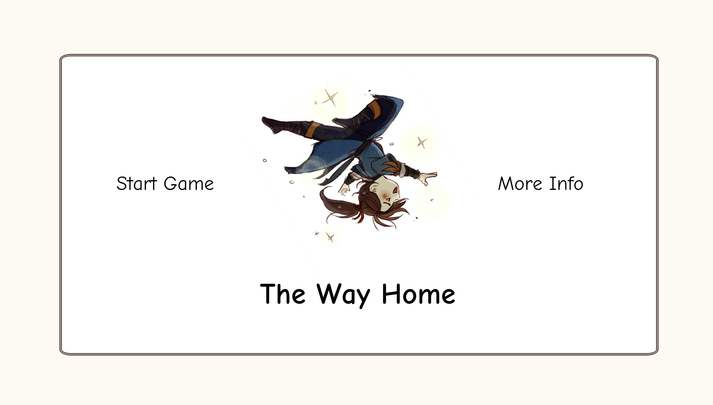
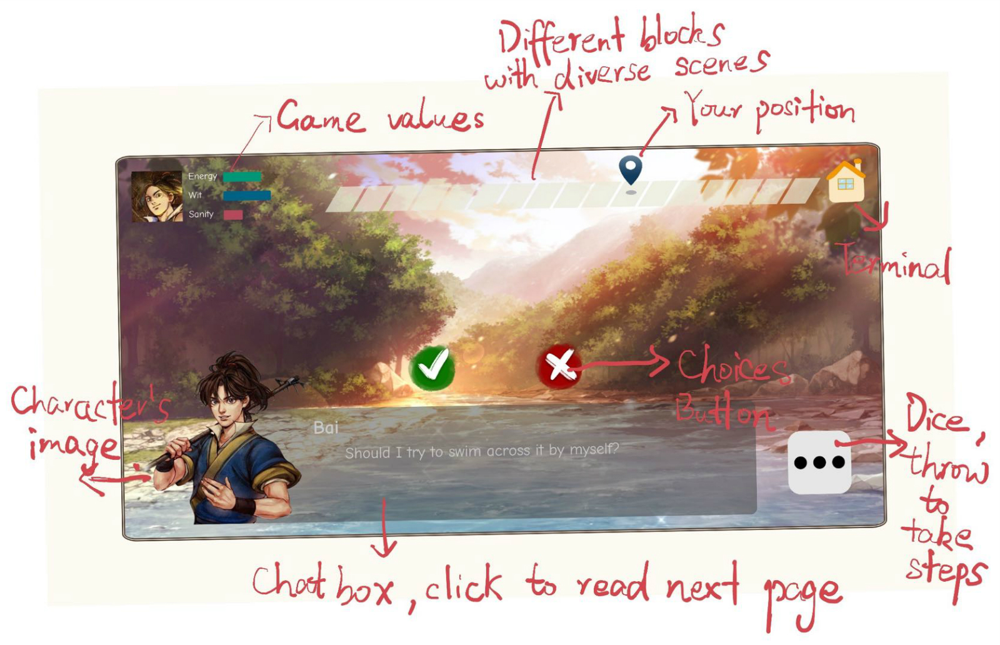
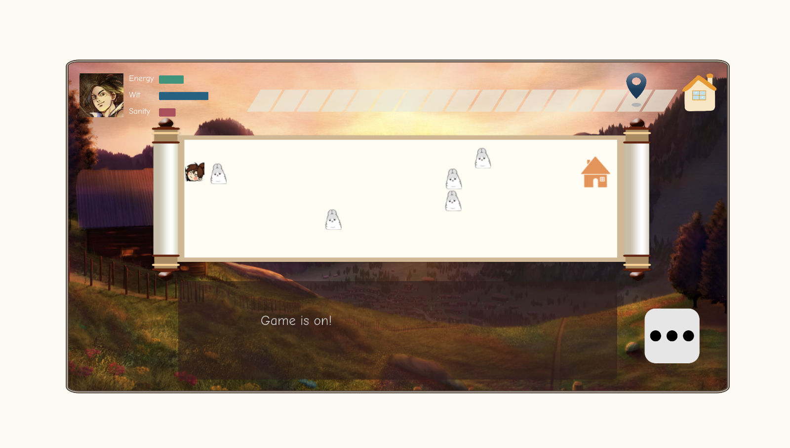
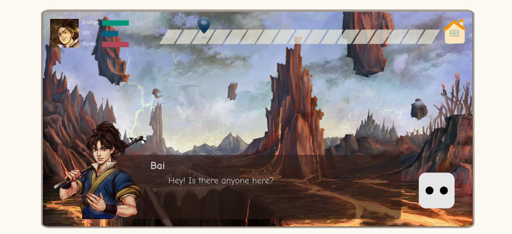

# The Way Home

[Game Link on Zeit]([https://the-way-home.now.sh/](https://baoatwork.github.io/the-way-home/))

## Description
   The way home is a web-based interactive board game. In this game, players would play a character who was sent to an unknown world by accident and try to find the way home. The main goal for the player is to throw dice to move to different blocks and interact with upcoming events before reaching the terminal. This project presents multiple interactive methods including choices, mouse click, key press and more to lead players to diverse storylines and ends. In the process of the adventure, players would get to know more about this strange world and the character.

## Creaters
   Sumner Feng & Emily Qiu

## Demos & Documentation

   [A Video Presentation](https://drive.google.com/file/d/1osDV0DS2jfMPMnXv7W1iKuxqtHWZoe84/view?usp=sharing)

## Artist Statement

## Guide

## Ciations
   #### -For Code-
   JS Library: [P5.js](https://p5js.org/)

   #### -For Art Source-
   Character's image: DongFang WeiMing from [Tale of Wuxia](http://wulin.fhyx.com/)
   
   Background images: [from Pixiv](https://www.pixiv.net/)

   #### -For Sound Source-
   The Welcome page Bgm: コース8:雪ステージ from Kirby Series
   
   The Bgm for the scenes of wasteland, grassland, river and village: from Moonlight Blade
   
   The Bgm for the scene of forest: 目光中的神 from Glory of Kings
   
   The Game Over page Bgm: 归去谣 from Moonlight Blade

## Screenshots

## Update History
   4.15: The first complete version
